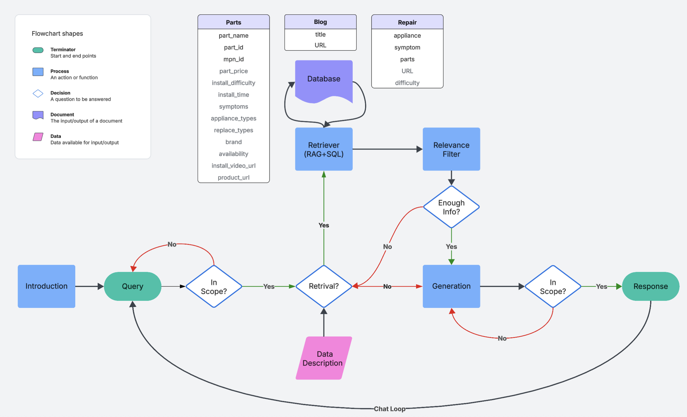

# PartSelect Chat Agent
PartSelect Chat Agent is an intelligent conversational system designed to assist users with appliance parts selection and repair guidance. The agent combines advanced RAG (Retrieval-Augmented Generation) technology with SQL database integration to provide accurate, context-aware responses for appliance maintenance and repair queries.

## Key Features
- 🔍 Smart parts identification and pricing information
- 🛠️ Step-by-step repair guidance
- 📚 Access to comprehensive repair documentation and blog posts
- 🤖 Context-aware conversation handling
- 💡 Intelligent retrieval system combining RAG and SQL for accurate responses

## System Architecture


This flowchart shows the system's architecture including:
- Database structure (Parts, Blog, Repair tables)
- Retrieval process using RAG + SQL
- Chat loop flow with query processing and response generation

## Interface Demo


## Installation

### Prerequisites
- Python 3.11 or higher
- Conda or pip package manager
- Git

### Setting up the environment

1. Clone the repository:
```bash
git clone https://github.com/zehuiwu/partselect-agent.git
cd priceselect-agent
```

2. Create and activate a new conda environment:
```bash
conda create -n new_env python=3.11
conda activate new_env
```

3. Install the required packages:
```bash
pip install -r requirements.txt
```

### Environment Variables
Create a `.env` file in the root directory with the following variables:
```
OPENAI_API_KEY=your_openai_api_key
DEEPSEEK_API_KEY=your_deepseek_api_key
```

Replace `your_*_api_key` with your actual API keys.

Note: Make sure to keep your `.env` file private and never commit it to version control.

### MySQL MCP Server Setup

1. Install MySQL:
   - For macOS: `brew install mysql`
   - For Ubuntu: `sudo apt-get install mysql-server`
   - For Windows: Download and install MySQL from the official website

2. Start MySQL service:
   - For macOS: `brew services start mysql`
   - For Ubuntu: `sudo service mysql start`
   - For Windows: MySQL service should start automatically

3. Import the data:
   ```bash
   # Create the database
   mysql -u root -p -e "CREATE DATABASE partselect;"
   
   # Import the CSV files
   mysql -u root -p partselect < data/all_parts.csv
   mysql -u root -p partselect < data/all_repairs.csv
   ```

4. Add the following environment variables to your `.env` file:
   ```
   MYSQL_HOST=localhost
   MYSQL_PORT=3306
   MYSQL_USER=root
   MYSQL_PASSWORD=your_password
   MYSQL_DATABASE=partselect
   ```

   Replace `your_password` with your MySQL root password.

Note: Make sure the MySQL server is running before starting the PriceSelect Chat Agent.

## Starting the Web Interface

To start the web interface:

1. Navigate to the web client directory:
   ```bash
   cd lily_client/web
   ```

2. Start the server with hot reloading enabled:
   ```bash
   hypercorn app:app --reload
   ```

3. Open your web browser and navigate to `http://localhost:8000` to access the web interface.
